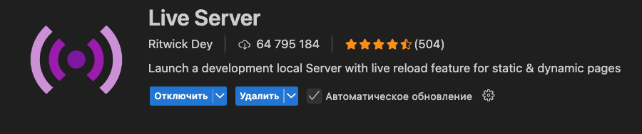

Стартовый набор для выполнения проектной работы Место

Для запуска приложения необходимо использовать live-server

Live-server является расширением VSCode

# Mesto

## Ссылка на проект
https://guzykkkkk.github.io/mesto-production/

## Команды

Установить зависимости:
```bash
npm install